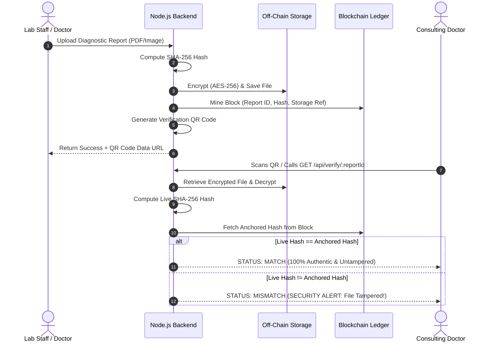

# System Design Specification: Medical Report Management & Distribution System on Blockchain

**Academic Year:** 2026–2027  
**Department:** Computer Science & Engineering  
**Project Phase:** Phase 2 Evaluation (Design & Implementation)

---

## 1. System Objectives & Rationale

### Objective 1: Reduce Repeated Diagnostic Tests
* **Requirement:** Enable authorized healthcare professionals to rapidly retrieve and review a patient's historical diagnostic reports during triage and clinical consultations.
* **Why We Chose This Objective:** When a patient's historical investigations are scattered across different clinics, hospitals, or paper files, they are frequently unavailable during emergency consultations. Attending physicians are forced to re-order the same blood tests, X-rays, or CT scans. Rapid retrieval via a consolidated chronological timeline gives doctors immediate clinical context, dramatically cutting healthcare costs, reducing patient radiation exposure, and speeding up treatment.

### Objective 2: Detect Duplicate Medical Reports via SHA-256 Hashing
* **Requirement:** Compute a cryptographic SHA-256 hash for every incoming report and compare it against the blockchain ledger prior to storage, maintaining a single verified reference per unique investigation.
* **Why We Chose This Objective:** The same diagnostic document is often uploaded multiple times across referral networks, leading to redundant cloud storage consumption and fragmented version histories. The SHA-256 digest serves as a mathematical fingerprint: if an incoming file matches an existing anchored block, the upload is prevented (HTTP 409 Conflict), enforcing deduplication and single-source truth.

### Objective 3: Chronological Medical History Timeline
* **Requirement:** Automatically aggregate diagnostic reports for a given patient into a sequential, filterable timeline spanning all past healthcare visits.
* **Why We Chose This Objective:** Separate, unorganized PDF files make it difficult for doctors to observe disease progression (e.g. tracking fasting blood sugar fluctuations or disc degeneration over multiple quarters). Arranging investigations chronologically with category filters provides a holistic view of the patient’s health trajectory.

---

## 2. High-Level Architecture (Figure 6.1)

The system enforces a clean separation between **Off-Chain Encrypted Storage** and **On-Chain Blockchain Anchoring**:

```
+---------------------------------------------------------------------------------------------------+
|                                             USERS                                                 |
|   [Doctor] (Search/View)    [Lab Staff] (Upload)    [Patient] (View/Share)    [Admin] (Audit)     |
+--------------------------------------------------+------------------------------------------------+
                                                   | HTTPS (Secure Web Interface)
                                                   v
+---------------------------------------------------------------------------------------------------+
|                                      APPLICATION LAYER                                            |
|                  Frontend UI (HTML5, Modern CSS Glassmorphism, JavaScript SPA)                    |
|                        Backend API Server (Node.js & Express.js Engine)                           |
+--------------------------+-------------------------------------------------+----------------------+
                           |                                                 |
                           v                                                 v
           +-------------------------------+                 +-------------------------------+
           |    REPORT FILE PROCESSING     |                 |  HASH GENERATION & DUPLICATE  |
           | 1. Medical Report (PDF/Img)   |                 | 1. Compute SHA-256 Hash       |
           | 2. AES-256-CBC Encryption     |                 | 2. Compare with Existing Chain|
           | 3. Store in uploads/          |                 | 3. If Match -> Block Duplicate|
           +---------------+---------------+                 +---------------+---------------+
                           |                                                 | (If New Report)
                           v                                                 v
+------------------------------------------+     +--------------------------------------------------+
|           OFF-CHAIN STORAGE              |     |          PERMISSIONED BLOCKCHAIN LAYER           |
|  - AES-256 Encrypted Binary Blobs        |     |  Consortium Nodes: Hospital, Lab, Clinic, Pharm   |
|  - Storage Reference Pointer             |     |  Stores ONLY:                                    |
|  - Accessible only with Decryption Key   |     |    * Pseudonymous Report ID (e.g. REP-7A91F2C4)  |
|  - Zero PII / Zero Patient Data On-Chain |     |    * Cryptographic SHA-256 File Hash             |
+------------------------------------------+     |    * Off-chain Storage Reference Pointer         |
                                                 |    * Block Hash, Previous Hash, Timestamp        |
                                                 +--------------------------------------------------+
                                                                     |
                                   Verification Flow (MATCH / MISMATCH)
                                                                     v
                                                 +--------------------------------------------------+
                                                 |        QR CODE ANTI-FORGERY VERIFICATION         |
                                                 |  Doctor scans QR -> Backend recalculates SHA-256 |
                                                 |  Compares live hash to blockchain -> Alert!      |
                                                 +--------------------------------------------------+
```

### 5-Step Core System Workflow
1. **Upload:** Staff member uploads a diagnostic file (PDF/Image) along with patient metadata.
2. **Duplicate Check & Off-Chain Encryption:** SHA-256 hash is computed. If unique, file is encrypted using AES-256-CBC and committed to off-chain storage.
3. **Blockchain Anchoring:** A new block is mined on the permissioned ledger recording the pseudonymous report ID, SHA-256 hash, timestamp, and storage pointer.
4. **QR Generation:** A high-resolution QR code is generated pointing to the verification endpoint.
5. **Authorized Retrieval & Verification:** Doctors retrieve the record, decrypt using the institution key, and compare hashes for 100% integrity validation.

---

## 3. Layered Architecture & Core Modules (Figure 6.2)

### 3.1 Application Layer
* **Frontend:** Responsive, single-page application crafted with vanilla HTML5, modern CSS3 glassmorphism, CSS custom properties, and JavaScript. Zero complex client framework overhead.
* **Backend:** Node.js runtime with Express.js REST API routing, Multer memory storage buffers, and JWT authentication.

### 3.2 Core Modules (Business Logic)
* **Report Management Module:** Orchestrates upload parsing, cryptographic key management, off-chain file writing, and retrieval streaming.
* **Duplicate Detection Engine:** Queries the blockchain ledger by SHA-256 digest to prevent identical uploads.
* **Smart Keyword Extraction (OCR):** Uses `Tesseract.js` to parse textual diagnostics from images and scans, tagging documents with clinical entities ("Blood Sugar", "Fracture", "Hemoglobin") for search indexing without decrypting the entire database.
* **Chronological Timeline Engine:** Sorts and filters historical records by patient ID and date.

### 3.3 Data Storage Layer
* **Off-Chain Encrypted Storage:** AES-256-CBC encrypted `.bin` files stored in a dedicated protected repository (`uploads/`).
* **Application Database:** JSON / MongoDB document store holding user accounts, report metadata tags, time-expiring shared link tokens, and immutable audit logs.

### 3.4 Permissioned Blockchain Layer
* **Consortium Nodes:** Pre-authorized institutional participants:
  - `NODE-HOSP-01`: Metro Apex Hospital (Validator)
  - `NODE-LAB-01`: Pathology Diagnostics Lab (Participant)
  - `NODE-CLINIC-01`: City Care Clinic (Participant)
  - `NODE-PHARM-01`: CareFirst Pharmacy (Participant)
* **Cryptographic Chaining:** Each block references the preceding block's SHA-256 hash (`previousHash`). Tampering with any byte invalidates all subsequent block hashes.

---

## 4. Key Feature Workflows

### 4.1 QR Code-Based Anti-Forgery (Feature 7.1)


### 4.2 Time-Expiring Secure Access Links (Feature 7.2)
* **Token Structure:**
  $$\text{JWT Payload} = \{\text{reportId}, \text{patientId}, \text{accessContext}, \text{iat}, \text{exp}\}$$
* **Workflow:**
  1. Patient selects report and configures expiration window (e.g., 2 minutes for demo, 1 hour for consultation).
  2. Backend signs a time-limited JWT using secret HMAC key.
  3. Consulting doctor opens link (`/shared.html?token=...`).
  4. Client dashboard renders live animated countdown timer.
  5. While valid: displays decrypted report.
  6. Upon expiration: system automatically revokes access, returning `HTTP 403 Forbidden: Access Link Expired`.

### 4.3 Smart Keyword Extraction (OCR) (Feature 7.3)
1. **OCR Ingestion:** When an image or document is uploaded, `tesseract.js` executes text recognition.
2. **Clinical Entity Mapping:** A dictionary-backed entity extractor identifies recognized diagnostic terms (e.g. Glucose, HbA1c, Fracture, Lumbar, Platelet, Cholesterol).
3. **Metadata Indexing:** Extracted tags are stored in the searchable database index alongside the Report ID.
4. **Zero-Decryption Search:** When a doctor searches for "Fracture", the query resolves against the tag index in sub-millisecond time without decrypting all raw medical files off-chain.

---

## 5. Security & Threat Model

| Threat / Attack Vector | Vulnerability in Centralized Systems | Proposed Blockchain Mitigation |
|------------------------|---------------------------------------|--------------------------------|
| **Unauthorized File Tampering** | Privileged admin or hacker modifies lab values directly in SQL database. | Recalculated SHA-256 immediately mismatches anchored blockchain block, alerting doctor with crimson **MISMATCH** warning. |
| **Ransomware Data Loss** | Single database server is encrypted by malicious ransomware. | Distributed consortium ledger ensures ledger provenance survives; off-chain files can be independently verified against cold backups. |
| **Data Breach / Public Exposure** | Medical files leaked directly from server. | All stored files are AES-256 encrypted at rest; files cannot be read without cryptographic keys. |
| **Permanent Unauthorized Access** | Doctor retains permanent access after one consultation. | Time-expiring signed JWT links automatically expire; tokens become permanently invalid after configured duration. |
| **Ledger Tampering / Block Editing** | Malicious participant rewrites block history. | SHA-256 block hash chaining requires re-mining every descendant block; `verifyChain()` detects tampering instantly. |
