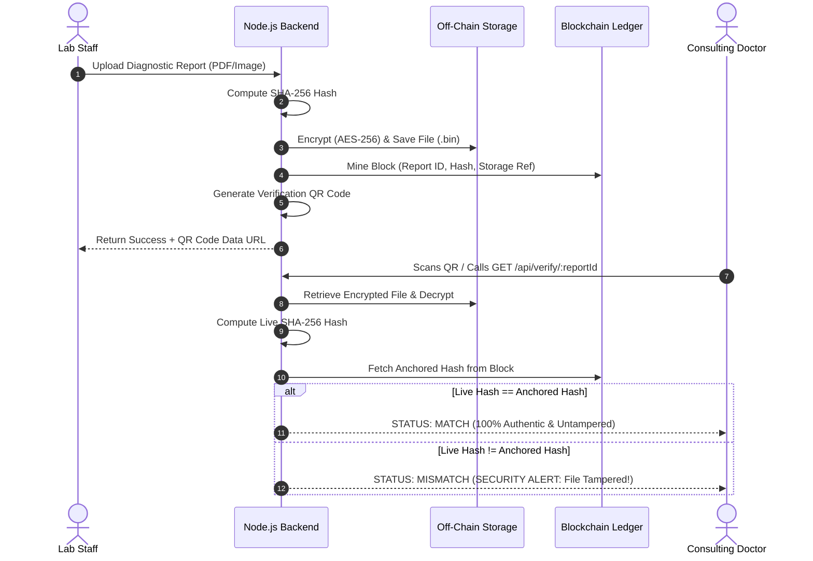

# System Design Specification: Medical Report Management & Distribution System on Blockchain

**Academic Year:** 2026–2027  
**Department:** Computer Science & Engineering  
**Project Phase:** Phase 2 Evaluation (Design & Implementation)

---

## 1. System Objectives & Rationale

### Objective 1: Reduce Repeated Diagnostic Tests
* **Requirement:** Enable authorized healthcare professionals to rapidly retrieve and review a patient's historical diagnostic reports during triage and clinical consultations.
* **Why We Chose This Objective:** When a patient's historical investigations are scattered across different clinics, hospitals, or paper files, they are frequently unavailable during emergency consultations. Attending physicians are forced to re-order the same blood tests, X-rays, or CT scans. Rapid retrieval via a consolidated chronological timeline gives doctors immediate clinical context, dramatically cutting healthcare costs, reducing patient radiation exposure, and speeding up treatment.

### Objective 2: Detect Duplicate Medical Reports via SHA-256 Hashing
* **Requirement:** Compute a cryptographic SHA-256 hash for every incoming report and compare it against the blockchain ledger prior to storage, maintaining a single verified reference per unique investigation.
* **Why We Chose This Objective:** The same diagnostic document is often uploaded multiple times across referral networks, leading to redundant cloud storage consumption and fragmented version histories. The SHA-256 digest serves as a mathematical fingerprint: if an incoming file matches an existing anchored block, the upload is prevented (HTTP 409 Conflict), enforcing deduplication and single-source truth.

### Objective 3: Chronological Medical History Timeline
* **Requirement:** Automatically aggregate diagnostic reports for a given patient into a sequential, filterable timeline spanning all past healthcare visits.
* **Why We Chose This Objective:** Separate, unorganized PDF files make it difficult for doctors to observe disease progression (e.g. tracking fasting blood sugar fluctuations or disc degeneration over multiple quarters). Arranging investigations chronologically with category filters provides a holistic view of the patient’s health trajectory.

---

## 2. High-Level Architecture & RBAC Security Gate

### 2.1 Mandatory Login Gate & Zero-Trust Authentication
The system enforces a mandatory pre-authentication gateway. All application routes, report viewers, upload dropzones, and blockchain ledger controls are locked behind a cryptographic JWT authentication gate:

```
+---------------------------------------------------------------------------------------------------+
|                                     MANDATORY LOGIN GATE                                          |
|            Authentication Required (JWT Session Token + Zero-Trust Role Routing)                  |
+---------------------------------------------------------------------------------------------------+
                                                  |
           +--------------------+-----------------+--------------------+--------------------+
           |                    |                                      |                    |
           v                    v                                      v                    v
      [LAB STAFF]            [DOCTOR]                              [PATIENT]             [ADMIN]
  - Upload Test Reports  - Search Reports via OCR              - View Own Records   - Enroll Doctors & Patients
  - Deduplication Check  - Edit Clinical Notes & Diagnosis     - Download Decrypted - Manage Consortium Directory
  - Ledger Anchoring     - Inspect Patient Timelines           - Verify QR Code     - Audit Chain Integrity
           |                    |                                      |                    |
           +--------------------+-----------------+--------------------+--------------------+
                                                  |
                                                  v HTTPS (REST API)
+---------------------------------------------------------------------------------------------------+
|                                      APPLICATION LAYER                                            |
|                  Frontend UI (HTML5, Modern CSS Glassmorphism, JavaScript SPA)                    |
|                  Backend API Server (Node.js, Express.js Engine, RBAC Guards)                     |
+---------------------------------------------------------------------------------------------------+
```

### 2.2 Role-Based Access Control (RBAC) Specification
1. **🔬 Lab Staff:** Authorized exclusively to upload diagnostic files, calculate SHA-256 digests, and trigger duplicate detection. Blocked from editing doctor diagnoses.
2. **👨‍⚕️ Doctor:** Authorized to search reports via OCR, review chronological timelines, and **edit/update clinical notes, diagnoses, prescriptions, and follow-up dates**.
3. **👤 Patient:** Strictly scoped to their own personal health records. Can view and download decrypted files with live SHA-256 blockchain verification and issue expiring links. **Blocked from uploading or editing reports**.
4. **🛡️ Consortium SuperAdmin:** Full administrative control to enroll new Doctors, Patients, and Lab Technicians with login credentials, inspect ledger health, and review audit logs.

### 2.3 Separation of Storage & Proof
Diagnostic medical files (PDFs, X-rays, lab scans) remain encrypted off-chain using **AES-256-CBC**, while the **Permissioned Blockchain Ledger** anchors immutable cryptographic proofs (pseudonymous Report IDs, SHA-256 digests, timestamps, and storage pointers).

---

## 3. Layered Architecture & Core Modules

### 3.1 Application Layer
* **Frontend:** Responsive, single-page application crafted with vanilla HTML5, modern CSS3 glassmorphism, CSS custom properties, and JavaScript. Includes the Mandatory Login Gate, Doctor Clinical Editor Modal, and Admin Identity Enrollment panel.
* **Backend:** Node.js runtime with Express.js REST API routing, Multer memory storage buffers, strict JWT verification, and Role-Based Access Control middleware (`authMiddleware.js`).

### 3.2 Core Business Modules
* **Authentication & Identity Module (`authController.js`):** Issues signed JWT tokens, verifies credentials, and manages user sessions.
* **Consortium Administration Module (`adminController.js`):** Handles registration of new Doctors, Patients, and Lab Staff identities, assigning wallet/node IDs and credentials.
* **Report Management & Review Module (`reportController.js`):** Orchestrates upload parsing, AES-256 off-chain encryption, retrieval streaming, and **Doctor Clinical Diagnosis Updates (`PUT /api/reports/:id`)**.
* **Duplicate Detection Engine:** Queries the blockchain ledger by SHA-256 digest to prevent redundant document uploads (HTTP 409).
* **Smart Keyword Extraction (OCR) (`ocrHelper.js`):** Uses `Tesseract.js` to parse textual diagnostics from images and scans, tagging documents with clinical entities ("Blood Sugar", "Fracture", "Hemoglobin") for search indexing without decrypting the entire database.
* **Chronological Timeline Engine:** Sorts and filters historical records by patient ID and date.
* **Anti-Forgery QR Engine (`qrController.js`):** Generates anti-forgery QR codes and verifies live off-chain file hashes against blockchain records.
* **Time-Expiring Sharing Module (`shareController.js`):** Generates cryptographically signed JWT consultation links with countdown timers and automated revocation.

### 3.3 Data Storage Layer
* **Off-Chain Encrypted Storage (`uploads/`):** AES-256-CBC encrypted `.bin` files stored in a dedicated protected repository.
* **Application Database (`data/database.json`):** Persistent JSON document store holding user accounts, report metadata tags, time-expiring shared link tokens, and immutable audit logs.

### 3.4 Permissioned Blockchain Layer
* **Consortium Nodes:** Pre-authorized institutional participants:
  - `NODE-HOSP-01`: Metro Apex Hospital (Validator)
  - `NODE-LAB-01`: Pathology Diagnostics Lab (Participant)
  - `NODE-CLINIC-01`: City Care Clinic (Participant)
  - `NODE-PHARM-01`: CareFirst Pharmacy (Participant)
* **Cryptographic Chaining:** Each block references the preceding block's SHA-256 hash (`previousHash`). Tampering with any byte invalidates all subsequent block hashes.

---

## 4. Key Feature Workflows

### 4.1 QR Code-Based Anti-Forgery (Feature 7.1)


### 4.2 Time-Expiring Secure Access Links (Feature 7.2)
* **Token Structure:**
  $$\text{JWT Payload} = \{\text{reportId}, \text{patientId}, \text{accessContext}, \text{iat}, \text{exp}\}$$
* **Workflow:**
  1. Patient selects report and configures expiration window (e.g., 2 minutes for demo, 1 hour for consultation).
  2. Backend signs a time-limited JWT using secret HMAC key.
  3. Consulting doctor opens link (`/shared.html?token=...`).
  4. Client dashboard renders live animated countdown timer.
  5. While valid: displays decrypted report.
  6. Upon expiration: system automatically revokes access, returning `HTTP 403 Forbidden: Access Link Expired`.

### 4.3 Doctor Clinical Evaluation Workflow
1. Attending physician signs in with Doctor credentials.
2. Selects diagnostic report and opens the **Doctor Clinical Notes Editor Modal**.
3. Inputs clinical findings, selects diagnosis status (e.g. *Confirmed Diagnosis, In Progress, Critical Attention Required*), prescription instructions, and follow-up consultation date.
4. Submits to `PUT /api/reports/:reportId`.
5. System verifies doctor role, persists updates, and writes an immutable audit log entry (`DOCTOR_CLINICAL_UPDATE`).

### 4.4 Admin Consortium Identity Enrollment Workflow
1. SuperAdmin logs into the Consortium User Management panel.
2. Fills out the identity registration form selecting role (Doctor, Patient, or Lab Staff).
3. Submits to `POST /api/admin/users`.
4. Backend validates input, checks for unique email, generates cryptographic identity ID, assigns blockchain node, and records the new member.
5. Newly registered user is immediately eligible for authentication at the Mandatory Login Gate.

---

## 5. Security & Threat Model

| Threat / Attack Vector | Vulnerability in Centralized Systems | Proposed Blockchain Mitigation |
| :--- | :--- | :--- |
| **Unauthorized File Tampering** | Privileged admin or hacker modifies lab values directly in SQL database. | Recalculated SHA-256 immediately mismatches anchored blockchain block, alerting doctor with crimson **MISMATCH** warning. |
| **Unauthorized Portal Snooping** | Open portals expose medical databases to unauthenticated users. | **Mandatory Login Gate** blocks all access without verified JWT session token. |
| **Role Privilege Escalation** | Patients or lab technicians modify physician diagnosis notes. | Strict backend **RBAC Guards** (`authorizeRoles`) reject unauthorized actions with `403 Forbidden`. |
| **Ransomware Data Loss** | Single database server is encrypted by malicious ransomware. | Distributed consortium ledger ensures ledger provenance survives; off-chain files can be independently verified against cold backups. |
| **Data Breach / Public Exposure** | Medical files leaked directly from server. | All stored files are AES-256 encrypted at rest; files cannot be read without cryptographic keys. |
| **Permanent Unauthorized Access** | Doctor retains permanent access after one consultation. | Time-expiring signed JWT links automatically expire; tokens become permanently invalid after configured duration. |
| **Ledger Tampering / Block Editing** | Malicious participant rewrites block history. | SHA-256 block hash chaining requires re-mining every descendant block; `verifyChain()` detects tampering instantly. |
